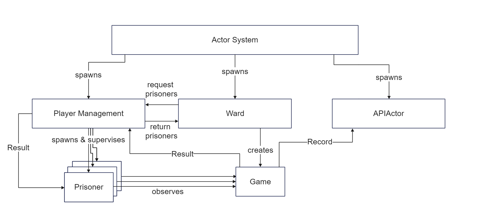
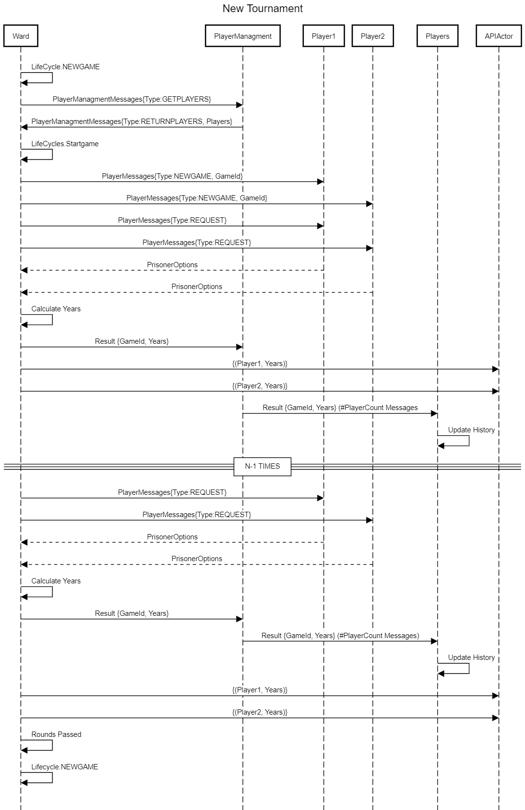
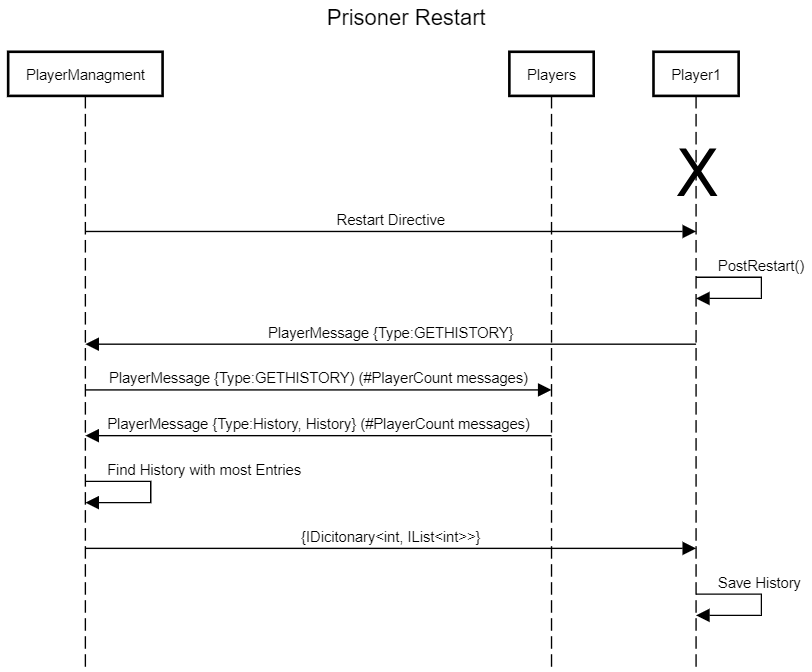
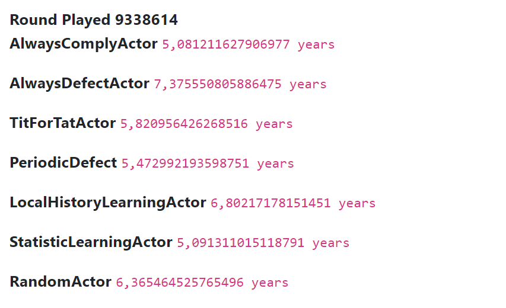

# S2010454017 - Prisoners Dilemma
Focus: Intelligence

There is also a little bit of Resilience (Prisoners geht restarted and get global history; No answer from Prisoners in allocated time -> Game waits a second and restarts from the current round. The game does this up to 3 times before stopping the game and starting a new one)

# Prisoners
- AlwaysComply
- AlwaysDefect
- RandomAnswer
- TitForTat
- PeriodicDefect (Defect after n Answers)
- LocalHistory (Learn for 200 Rounds, then try to detect opponent strategy and give answer answer which minimises Years)
- Statistic (Tries to give best answer according to the global history of all games)

# Observing a Match
All Prisoners who do not play the game, get the GameId aswell as the Year for each round in a game.
So every Prisoner knows what the current answers where (calculated from year), however they do not know who plays against who currently.
If they know, they do not need to be intelligent. The only thing they need to do would be some Pattern Matching on the global History

# Games
It is an all-vs-all style tournaments. Meaning every prisoner plays against every other prisoner an unlimited time of times.
A Game consists of 1000 Rounds where the same players fight against each other.
The Ward gets the answers from the playing prisoners using the ASK-Pattern. This is no problem though, as there is only one game at the time (in .NET the ASK-Pattern is also implemented using async/await)

# Restarting Prisoner
If a prisoner dies, the Playermanagment actor restarts the prisoner. After restarting the actor request the history from Playermanagment.
The Playermanagment then asks every prisoner for the history and send the history with the most entries back to the restarted prisoner.
The restarted prisoner therefore has the global history again.

## System Architecture

## Sequence Diagram Tournaments

## Sequence Diagram for Restarting Prisoner

## Average Years gotten per Prisoner

